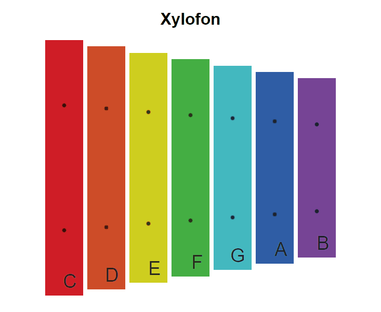

# Cvičení: Xylofon

## Zadání

Oživ xylofon, aby kliknutí na jednotlivé kameny měnilo nadpis stránky podle písmene na kameni a ozval se příslušný tón.



1. Vycházej z kódu v tomto repozitáři.

1. Pracuj v souboru `index.js`.

1. Soubory `index.html`, `styly.css` a složku `tony` si jen zběžně prohlédni.

1. Pomocí `querySelectorAll` najdi na stránce všechny kameny a přidej jim posluchač události na kliknutí.

1. V posluchači změň nadpis stránky `<h1>` na text stištěného kamene.

1. Se stiskem přehraj i příslušný mp3 soubor ze složky `tony`.

   Tón přehraješ tak, že si do proměnné uložíš nové audio a poté na něm zavoláš metodu `play`.

   ```js
   const zvuk = new Audio('tony/D.mp3')
   zvuk.play()
   ```

## Bonus

Přidej ovládání přes klávesnici.

1. Přidej posluchač události `keydown` na celou stránku.

1. Pokud vlastnost `code` vzniklé události začíná na `Digit`, ulož si do proměnné následující číslo. Například z `Digit4` si ulož `4`.

1. Pokud je číslo větší nebo rovno jedné a menší nebo rovno počtu kamenů, přehraj tón na příslušném kamenu. Nezapomeň, že pole se v JavaScriptu indexují od nuly, takže například pro číslo `1` přehraj tón na kameni s indexem `0`.
